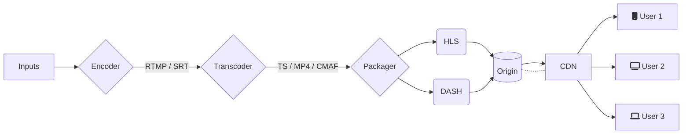

# APMC


## Part 2 

The easiest way to letterbox a video is with the pad filter:

```
ffmpeg -i aspect43.mp4 \
-vf pad="width=in_h*16/9:height=in_h:x=(out_w-in_w)/2:y=(out_h-in_h)/2:color=red" \ 
-c:a copy \
aspect169.mp4
```

To break this command down:
- `-i aspect43.mp4`
    - Here we're simply specifying the input
- `-vf pad="width=in_h*16/9:height=in_h:x=(out_w-in_w)/2:y=(out_h-in_h)/2:color=black"`
    - Applies a `pad` filter to the video
        - This does what you'd expect: adds padding to the image
    - Our filter is specifying our output to have:
        - Width equal to our input height, scaled by `16/9` 
        - Height equal to our input height 
        - The original input image centered in the output image
            - The `x` and `y` coordinates indicate the desired output position of the top-left pixel of the input image. 
            - Specifying `-1` for the `x` or `y` offsets will cause that axis to be centered
        - Black padding
            - This is the default, but could be changed for debug purposes
    - We're using more verbose syntax for clarity but the filter above can be condensed:
        - `-vf pad="ih*16/9:ih:-1:-1"` 
- `-c:a copy`
    - We're copying the audio directly from the input, without change 
- `aspect169.mp4`
    - Name our output file 
        

Note: While we are leaving the audio unchanged, the video does need to be re-encoded. Since we're not specifying any encoding parameters the defaults will be used. 


## Part 3




